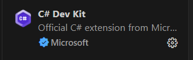
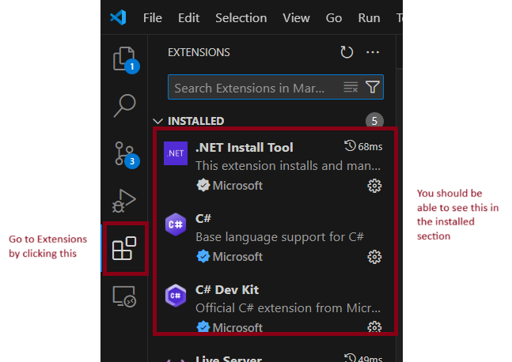
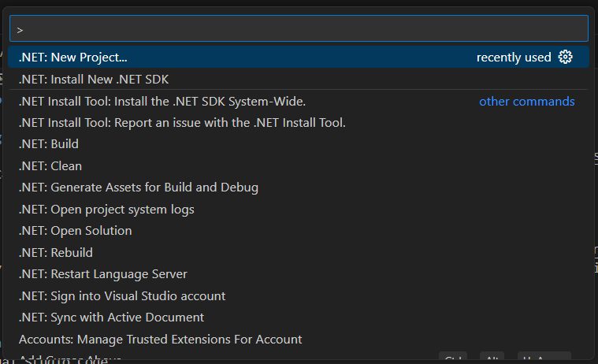
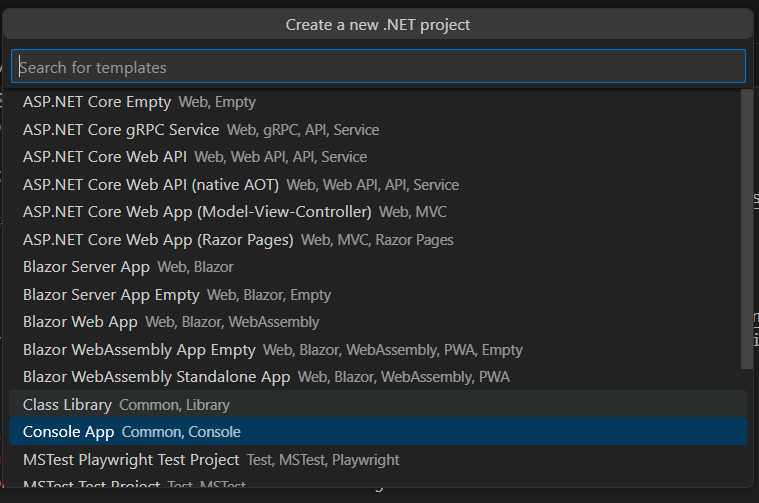
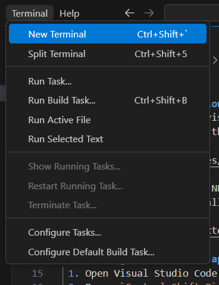

# Day 1 Lesson

## Installing Visual Studion Code
 1. Download and install visual studio code. [Click here to redirect to download link](https://code.visualstudio.com/download)
 2. Install C# Dev Kit in the extensions

    
 
 3. Download and Install .NET SDK. [Download here..](https://dotnet.microsoft.com/en-us/download)
 4. To verify if you install it correctly, You should be able to the the following extensitions when you navigate to extensions.

    

## Creating a new console app
 1. Open Visual Studio Code
 2. Press `Control+Shift+P` and Select *.NET New Project*.

    

 3. Select *Console App*

    

 4. Give it a name.
 5. Open Terminal by clicking Terminal and New Terminal

    

 6. Change directory to your project using `cd`
    ```
    cd [name_of_your_project]
    ```
 7. Run your code by typing `dotnet run`


## Review and Relearn C#
### Declaring Variables
 - Data Types
   ```
    int - integers or numbers like 1,2,...
    string - text like "Hello, World!"
    char - sigle character like 'c'
    bool - Boolean like true or false
   ```

 - When declaring variables you must follow this pattern: *dataType anyNameYouWant = initialValue*
    ex.
    ```c#
    // declare a new variable integer named sampleInt with initial value of zero
    int sampleInt = 0;
    ```
### String in C#
 - Concatenating string
    ```c#
    // declare new variable string
    string firstName = "Jomiel";
    string lastName = "Enriquez";
    // displays "Full Name: Jomiel Enriquez"
    Console.WriteLine("Full Name: " + firstName + " " + lastName);
    ```
 - Concatenating string with numbers
    ```c#
    // declare new variable string
    string firstName = "Jomiel";
    string lastName = "Enriquez";
    int age = 26;
    // displays "Full Name: Jomiel Enriquez, Age: 26"
    Console.WriteLine("Full Name: " + firstName + " " + lastName + ", Age: " + age);
    ```
 - String interpolation
    ```c#
    // declare new variable string
    string firstName = "Jomiel";
    string lastName = "Enriquez";
    int age = 26;
    // displays "Full Name: Jomiel Enriquez, Age: 26:
    Console.WriteLine($"Full Name: {firstName} {lastName} Age: {age}");
    ```
 - String contains
    ```c#
    // declare new variable string
    string nameRole = "Jomiel|Admin";
    
    /*
        check if the word Admin exists in nameRole variable
        will display boolean true or false
    */
    Console.WriteLine(nameRole.Contains("Admin"));
    ```

### Condition in C#
 - If Else
    ```c#
    Random random = new Random();
    int daysUntilExpiration = random.Next(12);
    int discountPercentage = 0;

    if (daysUntilExpiration == 0)
    {
       Console.WriteLine("Your subscription has expired.");
    }
    else if (daysUntilExpiration == 1)
    {
       Console.WriteLine("Your subscription expires within a day!");
       discountPercentage = 20;
    }
    else if (daysUntilExpiration <= 5)
    {
       Console.WriteLine($"Your subscription expires in {daysUntilExpiration} days.");
       discountPercentage = 10;
    }
    else if (daysUntilExpiration <= 10)
    {
       Console.WriteLine("Your subscription will expire soon. Renew now!");
    }
    if (discountPercentage > 0)
    {
       Console.WriteLine($"Renew now and save {discountPercentage}%.");
    }
    ```

 - Short If Else
    ```C#
    Random coin = new Random();

    Console.WriteLine(coin.Next(2) == 0 ? "Heads" : "Tails");
    ```
 - Switch
    ```c#
    int employeeLevel = 100;
    string employeeName = "John Smith";

    string title = "";

    switch (employeeLevel)
    {
        case 100:
        case 200:
            title = "Senior Associate";
            break;
        case 300:
            title = "Manager";
            break;
        case 400:
            title = "Senior Manager";
            break;
        default:
            title = "Associate";
            break;
    }

    Console.WriteLine($"{employeeName}, {title}");
    ```

### Basic Operation in C#
 - Implicit Data Type Conversion
    ```c#
    string firstName = "Bob";
    int widgetsSold = 7;
    Console.WriteLine(firstName + " sold " + widgetsSold + " widgets.");
    ```

 - Increment and Decrement Values
    ```c#
    int sampleValue = 0;

    sampleValue++;
    ```